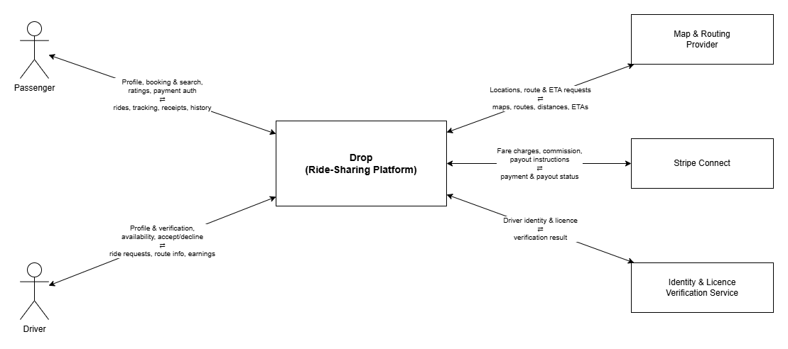

ifndef::imagesdir[:imagesdir: ../images]

[[section-context-and-scope]]
== Context and Scope

This chapter describes the environment and context of *Drop*: Who uses the system and on which other system does *Drop* depend.

ifdef::arc42help[]
[role="arc42help"]
****
.Contents
Context and scope - as the name suggests - delimits your system (i.e. your scope) from all its communication partners
(neighboring systems and users, i.e. the context of your system). It thereby specifies the external interfaces.

If necessary, differentiate the business context (domain specific inputs and outputs) from the technical context (channels, protocols, hardware).

.Motivation
The domain interfaces and technical interfaces to communication partners are among your system's most critical aspects. Make sure that you completely understand them.

.Form
Various options:

* Context diagrams
* Lists of communication partners and their interfaces.

.Further Information

See https://docs.arc42.org/section-3/[Context and Scope] in the arc42 documentation.

****
endif::arc42help[]

=== Business Context

ifdef::arc42help[]
[role="arc42help"]
****
.Contents
Specification of *all* communication partners (users, IT-systems, ...) with explanations of domain specific inputs and outputs or interfaces.
Optionally you can add domain specific formats or communication protocols.

.Motivation
All stakeholders should understand which data are exchanged with the environment of the system.

.Form
All kinds of diagrams that show the system as a black box and specify the domain interfaces to communication partners.

Alternatively (or additionally) you can use a table.
The title of the table is the name of your system, the three columns contain the name of the communication partner, the inputs, and the outputs.

****
endif::arc42help[]

_Passenger_

The passenger sends Drop their registration and profile data, ride
search criteria (pickup, destination and desired time), booking
requests, ride-completion confirmations, ratings and reviews, and
payment authorisation. In return, Drop provides the list of available
rides, booking confirmations, driver and vehicle details, real-time
tracking and ETA, fare receipts, and ride history.

_Driver_

The driver provides registration, profile and verification documents,
their availability and current location, the acceptance or decline of
ride requests, ride-completion confirmations, and ratings and reviews.
Drop sends the driver incoming ride requests, passenger and pickup
details, route and navigation information, earnings and payout
statements, and ride history.

_Payment Processor_

Drop sends the third-party Payment Processor fare charge requests,
commission deductions and driver payout instructions, and receives
payment and payout confirmations together with transaction status.

_Map & Routing Provider_

Drop sends the external Map & Routing Provider location coordinates,
route and ETA requests, and distance / fare estimation queries, and
receives map data, routes, travel distances and estimated times of
arrival.

_Identity & Licence Verification Service_

Drop submits driver identity and licence details to this external
service for checking and receives the verification or background-check
result. If drivers are instead verified manually in-house, this partner
can be omitted.

The Passenger and Driver are human actors interacting through the
mobile app. The Payment Processor, Map & Routing Provider and
Verification Service are external systems Drop depends on but does not
own (see constraint TC2). All personal data exchanged with these
actors and external systems is processed under constraint OC1
(GDPR / DSGVO); the external providers act as data processors under
Art. 28 GDPR.

=== Technical Context

ifdef::arc42help[]
[role="arc42help"]
****
.Contents
Technical interfaces (channels and transmission media) linking your system to its environment. In addition a mapping of domain specific input/output to the channels, i.e. an explanation which I/O uses which channel.

.Motivation
Many stakeholders make architectural decision based on the technical interfaces between the system and its context. Especially infrastructure or hardware designers decide these technical interfaces.

.Form
E.g. UML deployment diagram describing channels to neighboring systems,
together with a mapping table showing the relationships between channels and input/output.

****
endif::arc42help[]

Drop is broken into two main components:

_Frontend (Flutter mobile app)_

The client is built with Dart and Flutter and runs on Android and iOS
devices. It calls the backend over HTTPS, authenticates through
Firebase, subscribes to live data, and reads the device GPS sensor to
determine location.

_Backend (Spring Boot)_

The backend is a Spring Boot application that holds the business logic
and exposes a REST API over HTTPS. Persistent ride, profile and payment
data is stored in Cloud SQL (PostgreSQL); see chapters 7 and 8. Firebase
is used as a backing service for live data and push: Firestore holds the
short-lived driver-location and ride-status documents the apps subscribe
to through Firestore listeners, and Firebase Cloud Messaging delivers
push notifications. Maps, routing and payment are reached through
external providers over the Internet.

[cols="1,1", options="header"]
|===
| Business interface | Channel

| User authentication
| Firebase Authentication over the Internet (HTTPS)

| Business functions (booking, rides, history)
| Spring Boot REST API over the Internet (HTTPS)

| Live driver-location and ride-status updates
| Firebase database (Firestore) over the Internet (HTTPS / gRPC streaming)

| Push notifications
| Firebase Cloud Messaging (FCM / APNs)

| Maps, routing and ETA
| Third-party provider over the Internet (HTTPS)

| Payments
| Third-party payment provider over the Internet (HTTPS)
|===