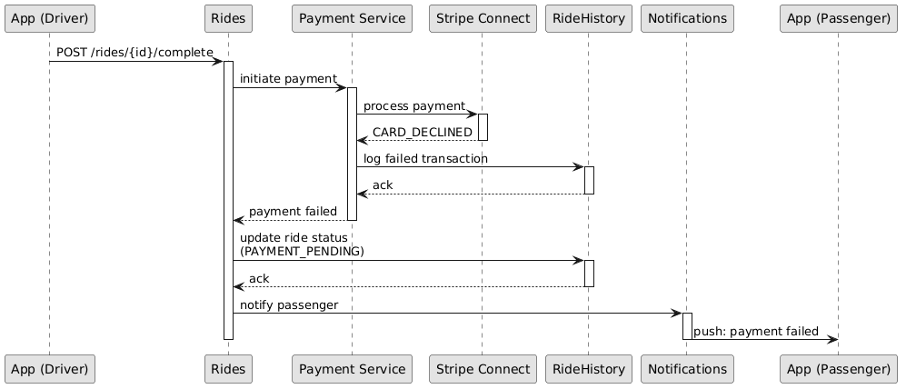
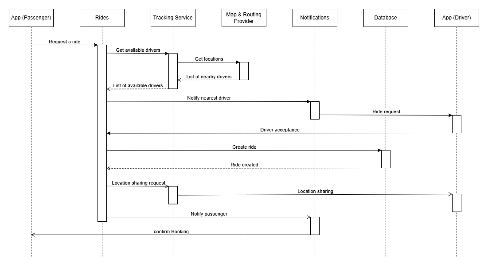
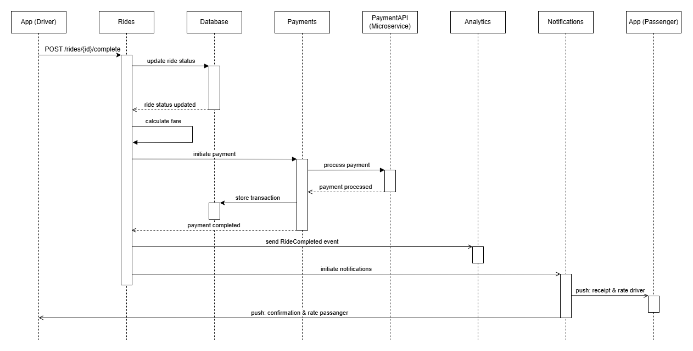

ifndef::imagesdir[:imagesdir: ../images]

[[section-runtime-view]]
== Runtime View

ifdef::arc42help[]
[role="arc42help"]
****
.Contents
The runtime view describes concrete behavior and interactions of the system’s building blocks in form of scenarios from the following areas:

* important use cases or features: how do building blocks execute them?
* interactions at critical external interfaces: how do building blocks cooperate with users and neighboring systems?
* operation and administration: launch, start-up, stop
* error and exception scenarios

Remark: The main criterion for the choice of possible scenarios (sequences, workflows) is their *architectural relevance*. It is *not* important to describe a large number of scenarios. You should rather document a representative selection.

.Motivation
You should understand how (instances of) building blocks of your system perform their job and communicate at runtime.
You will mainly capture scenarios in your documentation to communicate your architecture to stakeholders that are less willing or able to read and understand the static models (building block view, deployment view).

.Form
There are many notations for describing scenarios, e.g.

* numbered list of steps (in natural language)
* activity diagrams or flow charts
* sequence diagrams
* BPMN or EPCs (event process chains)
* state machines
* ...

.Further Information

See https://docs.arc42.org/section-6/[Runtime View] in the arc42 documentation.

****
endif::arc42help[]

The scenarios below cover the architecturally relevant flows of *Drop*:
the use cases that touch several building blocks, cross trust boundaries
or exercise the resilience and security concepts described in
chapter 8.

=== Scenario 1 – Payment Failure

Trigger:: The payment processor declines the passenger's card at the end of a ride.

Flow::
. *Rides* asks *Payment Service* to charge the passenger for the completed ride.
. *Payment Service* forwards the charge request to the external *Stripe Connect*
  microservice (Payment Processor).
. *Stripe Connect* rejects the charge and returns a `CARD_DECLINED` error to
  *Payment Service*.
. *Payment Service* logs the failed transaction in the *Database* with reason
  code `CARD_DECLINED` and returns a `paymentFailed` signal to *Rides*.
. *Rides* asks *Notifications* to alert the passenger that the payment failed
  and that they must update their payment method.
. *Notifications* pushes the failure message to *App (Passenger)*.
. *Rides* schedules a retry attempt (15-minute delay) and marks the ride as
  `PAYMENT_PENDING` in the *Database* until the payment is resolved.

=== Scenario 2 – Book a Ride

Trigger:: A passenger requests a ride from the mobile app.
 
Flow::
. *Rides* asks *Tracking Service* for the available drivers.
. *Tracking Service* queries the *Map & Routing Provider*,
  receives the list of nearby drivers and returns it to *Rides* as the
  list of available drivers.
. *Rides* selects the nearest driver and asks *Notifications* to
  notify the nearest driver; *Notifications* pushes the ride request to the
  *App (Driver)*.
. Should the driver decline the request, *Rides* would select the next nearest driver and repeat the notification step until a driver accepts or the list of available drivers is exhausted.  
. The driver accepts and *App (Driver)* responds directly back to *Rides*.
. *Rides* persists the ride in the *RideHistory*.
. *Rides* triggers location sharing through *Tracking Service*, which shares the Passenger's location with the *Driver*.
. *Rides* asks *Notifications* to confirm the booking to the passenger.
 
=== Scenario 3 – Ride Completion and Successful Payment

Trigger:: The driver marks the ride as completed.

Flow::
. *Rides* updates the ride status in the *Database* and receives
  "ride status updated".
. *Rides* calculates the fare (internal step).
. *Rides* asks *Payment Service* to initiate the payment; *Payment Service* calls the
  *Stripe Connect* microservice (Payment Processor) and receives confirmation that the payment has been processed.
. *Payment Service* stores the transaction in the *Database* and returns confirmation to *Rides*.
. *Rides* sends a `RideCompleted` event to *Analytics*.
. *Rides* asks *Notifications* to push the closing messages: the passenger
  receives a receipt and a prompt to rate the driver, and the driver
  receives a confirmation and a prompt to rate the passenger.