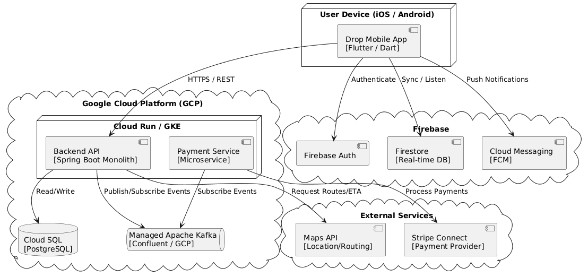

ifndef::imagesdir[:imagesdir: ../images]

[[section-deployment-view]]
== Deployment View

ifdef::arc42help[]
[role="arc42help"]
****
.Content
The deployment view describes:

 1. technical infrastructure used to execute your system, with infrastructure elements like geographical locations, environments, computers, processors, channels and net topologies as well as other infrastructure elements and

2. mapping of (software) building blocks to that infrastructure elements.

Often systems are executed in different environments, e.g. development environment, test environment, production environment. In such cases you should document all relevant environments.

Especially document a deployment view if your software is executed as distributed system with more than one computer, processor, server or container or when you design and construct your own hardware processors and chips.

From a software perspective it is sufficient to capture only those elements of an infrastructure that are needed to show a deployment of your building blocks. Hardware architects can go beyond that and describe an infrastructure to any level of detail they need to capture.

.Motivation
Software does not run without hardware.
This underlying infrastructure can and will influence a system and/or some
cross-cutting concepts. Therefore, there is a need to know the infrastructure.

.Form

Maybe a highest level deployment diagram is already contained in section 3.2. as
technical context with your own infrastructure as ONE black box. In this section one can
zoom into this black box using additional deployment diagrams:

* UML offers deployment diagrams to express that view. Use it, probably with nested diagrams,
when your infrastructure is more complex.
* When your (hardware) stakeholders prefer other kinds of diagrams rather than a deployment diagram, let them use any kind that is able to show nodes and channels of the infrastructure.

.Further Information

See https://docs.arc42.org/section-7/[Deployment View] in the arc42 documentation.

****
endif::arc42help[]

=== Infrastructure Level 1

Motivation::
The infrastructure strategy for Drop (RideShare) is rooted in a highly responsive, cloud-native architecture powered by the Google Cloud Platform (GCP). Because our application relies heavily on Firebase for secure authentication and push notifications, anchoring our backend within the Google ecosystem creates an unparalleled, low-latency synergy. 
Furthermore, we've designed the system to maximize our team's agility. By running the mobile applications directly on end-user devices and strategically delegating highly specialized domains to industry leaders—relying on Google Maps for complex routing, Stripe for secure, PCI-compliant payment processing, and a managed Apache Kafka service for high-throughput messaging—we eliminate the need to reinvent the wheel or operate complex socket infrastructures. This approach allows us to focus our resources entirely on delivering a robust, scalable, and exceptional ride-sharing experience.

Quality and/or Performance Features::
* **Scalability:** The GCP-hosted Spring Boot backend and Payment microservices are containerized and stateless. They run behind a managed load balancer on Cloud Run (or GKE) and scale horizontally. Real-time driver tracking is offloaded to Firestore, preventing socket connection bottlenecks on the main backend.
* **Resilience:** Cross-cutting resilience patterns (Circuit Breaker, Retry-with-Backoff) protect the backend when communicating with external dependencies. Asynchronous communication via Apache Kafka ensures that domain events (like ride completions) and live tracking streams are resilient, buffered, and not lost during traffic spikes.
* **Security:** Sensitive actions are explicitly authorized. User identities and JWTs are securely managed by Firebase, while sensitive payment processing is offloaded entirely to Stripe, keeping the GCP backend out of PCI-DSS scope.

Mapping of Building Blocks to Infrastructure::

[cols="1,2", options="header"]
|===
| Building Block | Infrastructure Node & Technology

| Mobile App
| End-user device (iOS/Android) built with Flutter/Dart.

| Backend API (Monolith)
| GCP Cloud Run / GKE; built with Spring Boot.

| Payment Service
| GCP Cloud Run / GKE independent container.

| Relational Database
| GCP Cloud SQL (PostgreSQL) storing operational data (Identity, Rides, Analytics).

| Real-time Data & Identity
| Firebase Authentication and Firestore.

| Event Bus / Live Tracking
| Managed Apache Kafka cluster (e.g., Confluent Cloud on GCP) for internal domain events and tracking streams.

| Map & Routing
| External Google Maps / GPS Services accessed via HTTPS.

| Payment Provider
| External Stripe Connect accessed via HTTPS and webhooks.
|===

=== Infrastructure Level 2

==== Mobile App
The cross-platform Flutter application runs natively on the user's iOS or Android device. It bundles the UI, a networking layer for REST API calls to the GCP backend, and specific Firebase SDKs for authentication, push notifications, and live ride tracking. Native OS bridges are utilized strictly when unavoidable, such as for background GPS location processing.

==== Backend API (Modular Monolith)
The Spring Boot application serves as the primary gateway for business logic. It manages bounded contexts (such as Rides and Matching) as a modular monolith. It is deployed as a stateless Docker container on GCP Cloud Run, allowing for rapid horizontal scaling based on HTTP traffic. State is managed externally via Firebase (for sessions) and Cloud SQL (for persistent relational records).

==== Event Bus (Apache Kafka)
Apache Kafka acts as the high-throughput nervous system of the architecture. It is utilized for robust, event-driven communication between the monolith and extracted microservices (like Payments), as well as streaming live communication data. When an event occurs (e.g., `RideCompleted`), the monolith publishes a message to a Kafka topic, which the Payment service consumes asynchronously to initiate the billing process without blocking the main thread. Utilizing a managed Kafka service keeps operational overhead low for the small team.

==== Third-Party Integrations
* **Stripe Connect:** Handled securely by the dedicated Payment Service to process charges and distribute driver payouts, tokenizing all card data to bypass local compliance burdens.
* **Firebase:** Used in tandem with Kafka as a managed real-time messaging layer. Driver locations and ride updates can be pushed to Firestore, providing low-latency streaming to the passenger's app without requiring the team to build and scale a custom WebSockets infrastructure.